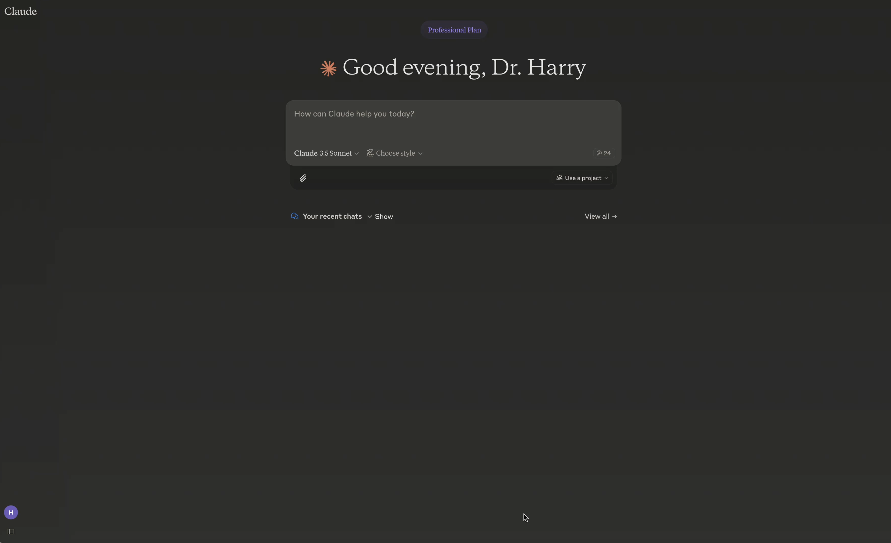

# Agent Care: An MCP Server for EMRs like Cerner and Epic

A Model Context Protocol (MCP) server that provides healthcare tools and prompts for interacting with FHIR data and medical resources on EMRs like Cerner and Epic using Claude Desktop and Goose Desktop.

[](https://smithery.ai/server/@Kartha-AI/agentcare-mcp)

## Demo
[](https://www.agentcare.ai/demo.mp4)

## Features
- EMR integrartion using SMART on FHIR APIs
- Uses OAuth2 to authenticate with EMRs 
- Anthropic Claude Desktop integration
- Medical research integration (PubMed, Clinical Trials, FDA)
- Response caching
- Error handling
- Null-safe data formatting
- Comprehensive clinical analysis

## Screenshots


## Tools

### FHIR Tools
- `find_patient` - Search for a patient by name, DOB, or other identifiers
- `get_patient_observations` - Retrieve patient observations/vital signs
- `get_patient_conditions` - Get patient's active conditions
- `get_patient_medications` - Get patient's current medications
- `get_patient_encounters` - Get patient's clinical encounters
- `get_patient_allergies` - Get patient's allergies and intolerances
- `get_patient_procedures` - Get patient's procedures
- `get_patient_careteam` - Get patient's care team members
- `get_patient_careplans` - Get patient's active care plans
- `get_vital_signs` - Get patient's vital signs
- `get_lab_results` - Get patient's laboratory results
- `get_medications_history` - Get patient's medication history
- `clinical_query` - Execute custom FHIR queries

### Medical Research Tools
- `search-pubmed` - Search PubMed articles related to medical conditions
- `search-trials` - Find relevant clinical trials
- `drug-interactions` - Check drug-drug interactions

## Usage

Each tool  requires specific parameters:

### Required Parameters
- Most tools require `patientId`
- Some tools have additional parameters:
  - `lab_trend_analysis`: requires `labType`
  - `search-pubmed`: requires `query` and optional `maxResults`
  - `search-trials`: requires `condition` and optional `location`
  - `drug-interactions`: requires `drugs` array

## Development Configuration 
- To use with Cerener: Go to https://code-console.cerner.com and create a sandbox account, create a new provider app and get the clientId/secret.
(note: ec2458f2-1e24-41c8-b71b-0e701af7583d below is the tenant id for cerner developer sandbox)

- To use with Epic: Go to https://fhir.epic.com/Developer/Apps , sign up as developer and create a new app and get the clientId/secret.

- For PubMed, Clinical Trials and FDA, you need to get the API keys from the respective websites.
  - https://clinicaltrials.gov/api/v2/studies
  - https://eutils.ncbi.nlm.nih.gov/entrez/eutils
  - https://api.fda.gov/drug/ndc.json

For local testing Create a `.env` file in the root directory or use these environment variables in claude desktop launch configuration.
#### Cerner
````
OAUTH_CLIENT_ID="XXXXX",
OAUTH_CLIENT_SECRET="XXXXXXX",
OAUTH_TOKEN_HOST="https://authorization.cerner.com", 
OAUTH_AUTHORIZE_PATH="/tenants/ec2458f2-1e24-41c8-b71b-0e701af7583d/protocols/oauth2/profiles/smart-v1/personas/provider/authorize",
OAUTH_AUTHORIZATION_METHOD='header',
OAUTH_TOKEN_PATH="/tenants/ec2458f2-1e24-41c8-b71b-0e701af7583d/hosts/api.cernermillennium.com/protocols/oauth2/profiles/smart-v1/token",
OAUTH_AUDIENCE="https://fhir-ehr.cerner.com/r4/ec2458f2-1e24-41c8-b71b-0e701af7583d",
OAUTH_CALLBACK_URL="http://localhost:3456/oauth/callback",
OAUTH_SCOPES="user/Patient.read user/Condition.read user/Observation.read user/MedicationRequest.read user/AllergyIntolerance.read user/Procedure.read user/CarePlan.read user/CareTeam.read user/Encounter.read user/Immunization.read",
OAUTH_CALLBACK_PORT="3456"
FHIR_BASE_URL:any = "https://fhir-ehr.cerner.com/r4/ec2458f2-1e24-41c8-b71b-0e701af7583d" 
PUBMED_API_KEY=your_pubmed_api_key
CLINICAL_TRIALS_API_KEY=your_trials_api_key
FDA_API_KEY=your_fda_api_key
````
#### Epic
````
OAUTH_CLIENT_ID="XXXXXXX",
OAUTH_CLIENT_SECRET="",
OAUTH_TOKEN_HOST="https://fhir.epic.com",
OAUTH_AUTHORIZE_PATH="/interconnect-fhir-oauth/oauth2/authorize",
OAUTH_AUTHORIZATION_METHOD='body',
OAUTH_TOKEN_PATH="/interconnect-fhir-oauth/oauth2/token",
OAUTH_AUDIENCE="https://fhir.epic.com/interconnect-fhir-oauth/api/FHIR/R4",
OAUTH_CALLBACK_URL="http://localhost:3456/oauth/callback",
OAUTH_SCOPES="user/Patient.read user/Observation.read user/MedicationRequest.read user/Condition.read user/AllergyIntolerance.read user/Procedure.read user/CarePlan.read user/CareTeam.read user/Encounter.read user/Immunization.read",
OAUTH_CALLBACK_PORT=3456
FHIR_BASE_URL:any = "https://fhir.epic.com/interconnect-fhir-oauth/api/FHIR/R4" //EPIC  
PUBMED_API_KEY=your_pubmed_api_key
CLINICAL_TRIALS_API_KEY=your_trials_api_key
FDA_API_KEY=your_fda_api_key
````

## Start MCP Server Locally 
````
git clone {agentcare-mcp-github path}
cd agentcare-mcp
npm install
npm run build
````

## Use claude desktop
````
for claude desktop: 
macOS: ~/Library/Application Support/Claude/claude_desktop_config.json
(use the env variables as shown above)

{
  "mcpServers": {
    "filesystem": {
      "command": "npx",
      "args": [
        "-y",
        "@modelcontextprotocol/server-filesystem",
        "/Users/your-username/Desktop"
      ]
    },
    "agent-care": {
      "command": "node",
      "args": [
        "/Users/your-username/{agentcare-download-path}/agent-care-mcp/build/index.js"
      ],
      "env": {
        "OAUTH_CLIENT_ID": XXXXXX,
        "OAUTH_CLIENT_SECRET":XXXXXXX,
        "OAUTH_TOKEN_HOST":,
        "OAUTH_TOKEN_PATH":,
        "OAUTH_AUTHORIZE_PATH",
        "OAUTH_AUTHORIZATION_METHOD": ,
        "OAUTH_AUDIENCE":,
        "OAUTH_CALLBACK_URL":,
        "OAUTH_SCOPES":,
        "OAUTH_CALLBACK_PORT":,
        "FHIR_BASE_URL":,
        "PUBMED_API_KEY":,
        "CLINICAL_TRIALS_API_KEY":,
        "FDA_API_KEY":
      }
    }
  }
}
````
## Use MCP Inspectopr
(MCP Server using inspector. Make sure to update the .env file with the correct values.)
````
npm install -g @modelcontextprotocol/inspector
mcp-inspector  build/index.js
http://localhost:5173

````

## Test User Logins
(commonly used for sandbox/dev)
- Cerner: portal | portal 
- Epic: FHIRTWO | EpicFhir11! 

## Troubleshooting:
If Claude desktop is running it uses port 3456 for Auth. You need to terminate that process using the following command:
````
kill -9 $(lsof -t -i:3456)
````

## Use Goose
Goose is an open Source AI Agent frameowrk from Block(Stripe) that works with MCP servers. Goose Desktop is like Claude Desktop that can work with MCP servers. But Goose can be configured to use models other than Anthropic as well. More info: https://block.xyz/inside/block-open-source-introduces-codename-goose

See below how Goose Desktop works with Agent Care:
(goose extension will be configured with command: 
/Users/your-username/{agentcare-download-path}/agent-care-mcp/build/index.js)


